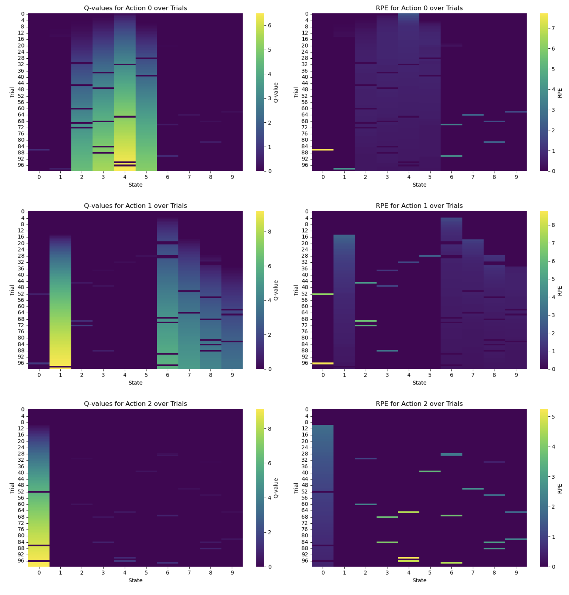
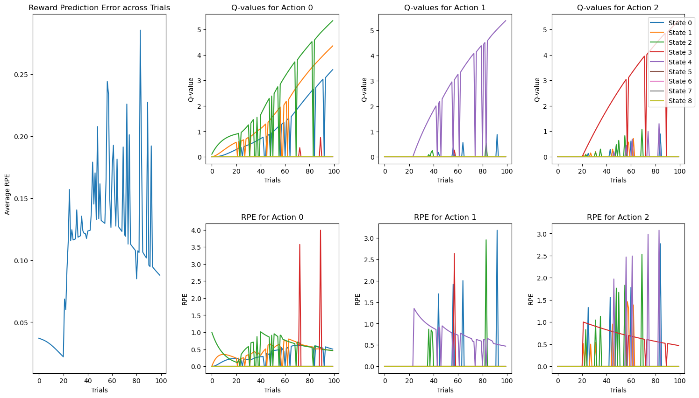
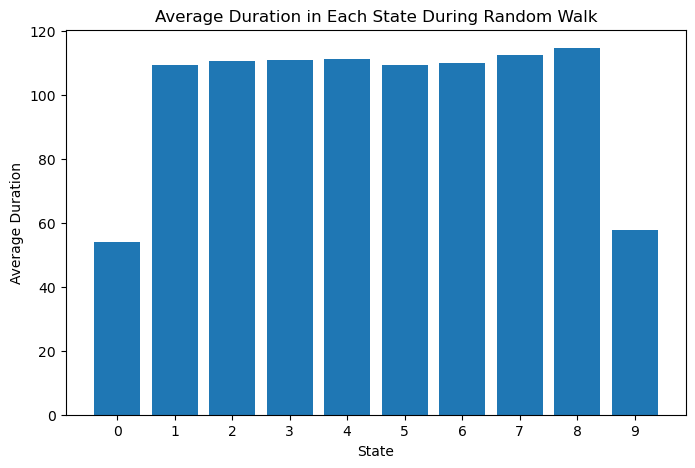
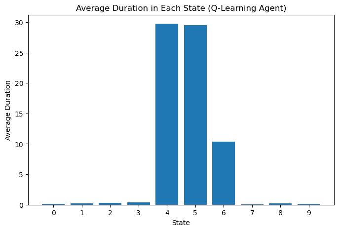

# Multi-addiction State Q-agent Decision Making
Simulating addicted and non-addicted Q learning agent and seeing different behavior effects in algorithm.

Previous study have done similar experiments on an TD agent and seeing teh chanegs in the expected value of the states. However, I think that when there are actions that can be taken, then things changes because with each different action, the agent is at a different state and such differences does make an impact in the decision making process.

No neural network is used in this research project, the core is to just look at the algorithm itself and reasoning with the innate mathamatical properties and characteristics behind the algorithm and try to find the aspects that resembles human behavior.

### Research Questions:
Under a discrete chain multi-addiction states setting, to what extent does a monotonic decreasing drug reward function affect an Q-agent equipped with various exploration strategy’s ability to make decisions and how does such process resemble human decision making under addiction.

### Current Progress:
1. Made addicted Q-learning agents class
    - Make Q-agent class with nice documentations
    - support functions include
        - learning
            - supports three types of search strategies: greedy, epsilon_greedy, and boltzmann exploration
        - resimulate average vissits with best Q matrix after learning
        - random walk of the agents
2. Made utils and bunch of plot functions & analysis performed
    - Draw decision graphs of different states against trials separate by action differences.
    - Draw heatmaps for different actions across trials
    - Draw average number of visits time and compare with the random walk process.

### TODOs:
1. Analysis:
    - plot the rpe average over all trials for the three difeferngt strategy.
2. More characteristics of neuroscience behavior.

### Preliminaries
#### Epsilon-greedy Policy

    

### Epsilon-greedy Policy (Alternate View)

    

#### Boltzman_Exploration Policy

    

### Average Visits to Stages When Double Natural Reward Presented
##### Random Walk

    

##### Trained Q-agent

    

