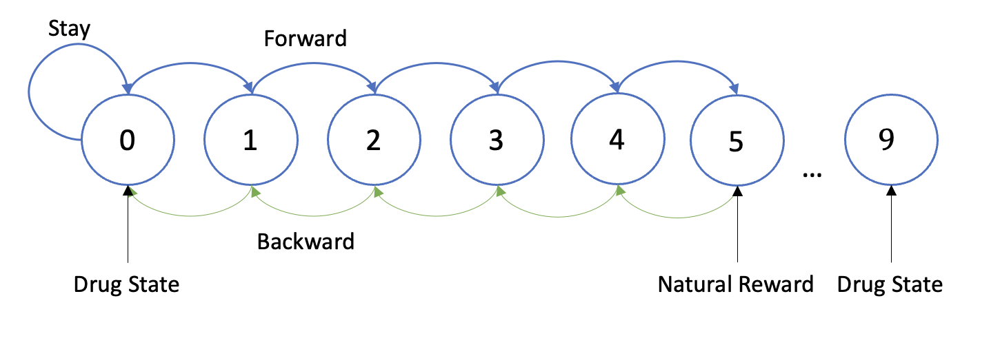
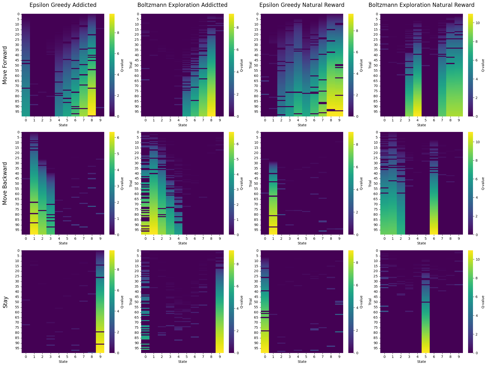
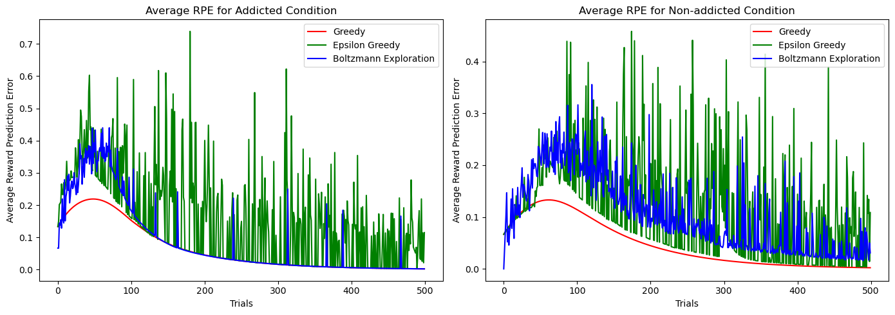
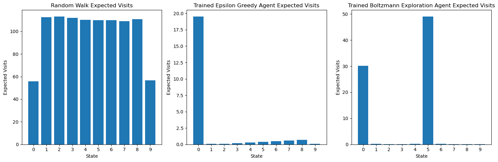

# Discrete Multi-addiction State Q-agent Decision Making
Manuscript [here](https://kevinbian107.github.io/assets/projects/addicted_rl_manuscrit.pdf)

Simulating addicted and non-addicted Q learning agent and seeing different behavior effects in algorithm.

Previous study have done similar experiments on an TD agent and seeing teh chanegs in the expected value of the states. However, I think that when there are actions that can be taken, then things changes because with each different action, the agent is at a different state and such differences does make an impact in the decision making process.

No neural network is used in this research project, the core is to just look at the algorithm itself and reasoning with the innate mathamatical properties and characteristics behind the algorithm and try to find the aspects that resembles human behavior.

## Research Questions:
Under a discrete chain multi-addiction states setting, to what extent does a monotonic decreasing dopamine surge function affect an Q-agent equipped with various exploration strategy’s ability to make decisions and how does such process resemble human decision making under addiction.

Demostrating the environment setting:

    

## Includeded in this Repo:
1. Addicted Q-learning agents class
    - support functions include
        - Learning
            - supports three types of search strategies: greedy, epsilon_greedy, and boltzmann exploration
        - Resimulate average vissits with best Q matrix after learning
        - Random walk of the agents
2. Utils and bunch of plot functions for analysis & figures
    - Decision graphs of different states against trials separate by action differences.
    - Heatmaps for different actions across trials
    - Expected number of visits time and compare with the random walk process.
    - RPE average over all trials for the three different strategy.
    - Combined figures for manuscript.

## Preliminaries

### Heatmap of Q-value for Different Startegy Agent and Reward States

    

### Average RPE for Different Search Strategy Q-agent Under Addiction/Non-Addiction

    

### Expected Visits When Natural Reward is Presented

    

