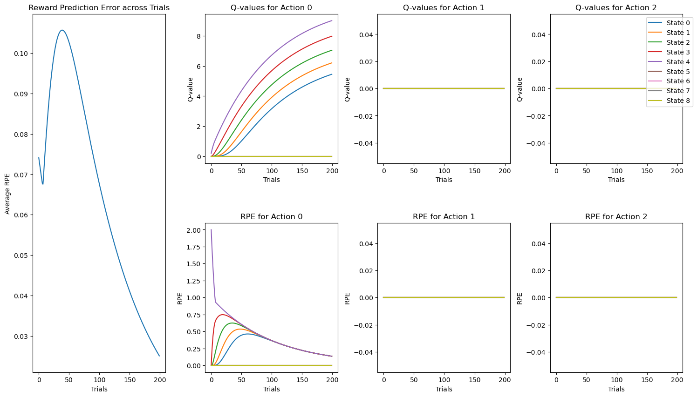

# Addicted_RL Making Decision
Simulating addicted and non-addicted Q learning agent and seeing different behavior effects in algorithm

Previous study have done similar experiments on an TD agent and seeing teh chanegs in the expected value of the states. However, I think that when there are actions that can be taken, then things changes because with each different action, the agent is at a different state and such differences does make an impact in the decision making process.

- No fancy neural network is used, just looking at the algorithm itself and reasoning with the innate mathamaticla characteristics behind it that resembles human behavior

### Current Progress:
1. Made addicted Q-learning agents class
    - Make Q-agent class with nice documentations
    - support functions include
        - learning,
        - resimulate average vissits with best Q matrix after learning,
        - random walk of the agents
2. Made utils and bunch of plot functions
3. Made random-walk model to compare with the Q-agent
4. Analysis
    - Draw decision graph of different state against trials separate by action differences.

### TODOs:
1. Analysis using the TD paper method
    - Try to repreoduce and extend the figures
2. More algorithms or characteristics of neuroscience behavior
    - UCB?

### Observation
1. Interesting phenomenon, seems like once state > 5, the agent is just jumping back and forth between states and seems to stuck there.
    - must use a counter to ensur ethat the while loop actually breaks.

### Preliminaries

#### Epsilon-greedy Policy

    

#### Greedy Policy

    

